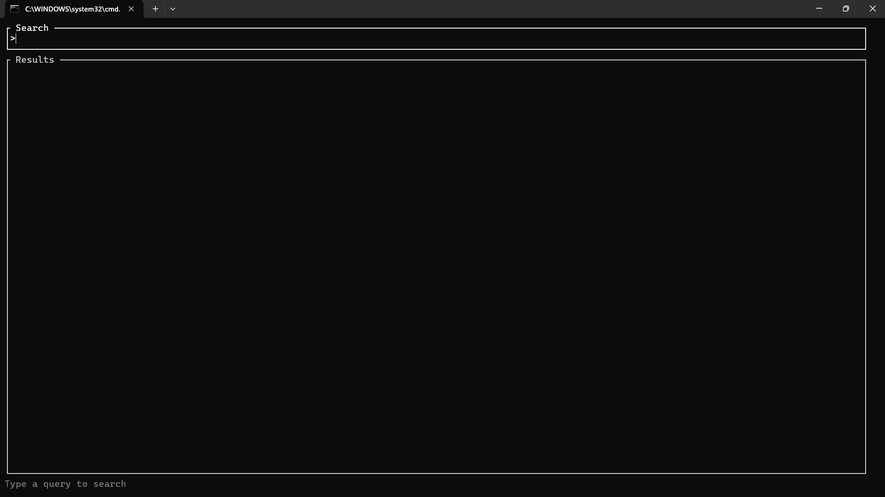
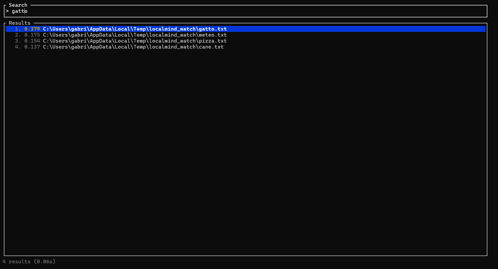
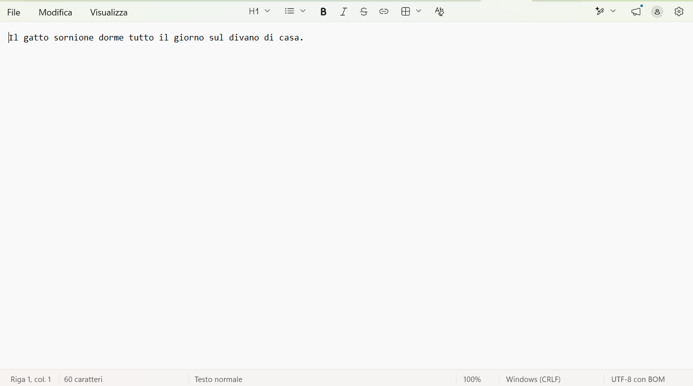

# LocalMind

A **local semantic search engine** written in Rust. Indexes `.txt`, `.pdf`, and `.docx` files, embeds them into vectors via a BERT model (all-MiniLM-L6-v2), and provides real-time semantic search through a terminal UI.

No external database, no cloud service, no API key. Everything runs locally on CPU.

```
┌──────────┐    ┌──────────┐    ┌──────────┐    ┌──────────────┐
│  embed   │ -> │  index   │ -> │  search  │ <- │   monitor    │
│ (BERT)   │    │ (binary) │    │ (SIMD)   │    │ (polling)    │
└──────────┘    └──────────┘    └──────────┘    └──────────────┘
                                                    │
                                                    v
                                              ┌──────────┐
                                              │   tui    │
                                              │ (ratatui)│
                                              └──────────┘
```

## Screenshots


*Empty TUI — write a query and press Enter (or wait for automatic search)*


*Query submitted, embedding in progress (~55–65ms on CPU, SIMD)*


*Results with similarity score, keyboard navigation via arrows*

## Design Principles

### No external databases

Every "semantic search" demo on the internet assumes you run a separate database — Pinecone, Qdrant, Weaviate, or pgvector. This adds operational complexity and often recurring costs. LocalMind stores its vectors in a **custom binary format** designed for memory-mapped O(1) access (detailed below). The entire index is a single file you can `cp`, `rsync`, or commit to a repo.

This choice comes with trade-offs: you don't get built-in replication, sharding, or incremental compaction. For a local tool indexing a few thousand files, those features are irrelevant. For millions of vectors, an approximate index (HNSW) is the right answer — but even that should be a local file, not a network service.

### The index file format

Most vector indexes store metadata alongside vectors in a database table, which means every search query goes through a serialization boundary (SQL or protobuf). LocalMind's binary format is designed around a simple observation: **a search reads every vector but only needs a few paths**.

```
┌─────────────────────────────────────────────────┐
│ Header: [u8;4] magic + u32 ver + u32 n + u32 d │  16 bytes
├─────────────────────────────────────────────────┤
│ vectors: [f32; d] × n, 8-byte aligned           │  384 × 4 × n bytes
├─────────────────────────────────────────────────┤
│ entries: [{offset: u64, len: u32}] × n          │  12 × n bytes
├─────────────────────────────────────────────────┤
│ strings: concatenated path bytes                │  variable
└─────────────────────────────────────────────────┘
```

- **Header**: magic `LMND` (0x4C4D4E44), format version, record count `n`, dimension `d` (always 384).
- **Vectors**: flat array of `n × d` floats, padded to 8-byte alignment. Each vector sits at a known offset — `header_size + i * d * 4` — so reading vector `i` is a single pointer dereference through the memory map.
- **Entry table**: fixed-size records of `offset: u64 + length: u32` pointing into the string block. Since every entry is the same size (12 bytes), locating entry `i` is O(1): `entry_table_offset + i * 12`.
- **Strings**: concatenated path strings with no separator — each entry's `(offset, len)` tells you exactly where its path lives.

The whole file is opened with `memmap2`, so the operating system manages paging. A search touches every vector (sequential read, prefetcher-friendly) but only reads `k` paths for the final results. You never deserialize the entire index into heap memory.

### Polling instead of filesystem events

The `notify` crate on Windows produces unreliable `is_file` events — rapid writes (common with editors) trigger spurious creation/deletion cycles. A polling loop with a 1-second interval and `blake3` hash comparison is simpler to reason about: it compares the *actual content* of every file at a fixed cadence, with zero false positives.

Polling burns CPU when nothing changes (~1% of a core on an SSD directory scan). On Linux/macOS, an `inotify`/`FSEvents` backend would be more efficient — but the polling loop is correct on every platform, and correctness beats efficiency when you're indexing someone's documents.

### SIMD by hand instead of BLAS

Most cosine similarity implementations call `dot` from a BLAS library — fine for large matrices, but for a hot loop that compares 384-dimensional vectors, you spend more time on function call overhead and bounds checks than on actual math. LocalMind uses the [`wide`](https://crates.io/crates/wide) crate to do SIMD directly:

```rust
// Distilled from search.rs — dot product on 8 f32s at once
let a8 = f32x8::from(a);
let b8 = f32x8::from(b);
acc = f32x8::mul_add(a8, b8, acc);  // FMA: a8 * b8 + acc
```

This avoids a BLAS dependency (saving binary size), makes the code obviously correct, and compiles down to a single `VFMADD231PS` instruction on any CPU with FMA support. The remainder (< 8 dimensions) falls back to a scalar loop. No SIMD dispatch, no runtime detection — `wide` generates the best instruction set available at compile time.

### Thread safety as architecture

Index updates happen in a polling thread (or any background thread in the future). Searches happen in the TUI thread. The shared state is `Arc<RwLock<Index>>`, where `Index` is the memory-mapped file + a few bookkeeping fields.

The update protocol:
1. Build the new index to a temporary file.
2. Memory-map the temp file.
3. Acquire a **write** lock on the `RwLock`.
4. Swap the `Arc` pointer (clone of the old `Arc` is cheap).
5. Drop the write lock.

Searches hold only a **read** lock, which never blocks another reader. The write lock is held for less than a microsecond — just the pointer swap and drop. This means embedding 20 files (taking seconds) does not pause the TUI or block ongoing searches. The old index continues to serve queries until the new one is ready, then transitions atomically.

### Binary size is a feature

A release binary of ~8 MB means you can `scp` it to a server, include it in a Docker image, or distribute it as a single file. This is achieved with three Cargo profile settings:

```toml
[profile.release]
lto = true
codegen-units = 1
strip = true
```

`lto = true` enables cross-crate inlining — the SIMD hot path gets inlined and specialized. `codegen-units = 1` lets LLVM see the entire crate at once (better optimization at the cost of compile time). `strip = true` removes debug symbols. The result is a self-contained binary that includes the BERT model weights loader, the tokenizer, a TUI framework, and the entire search pipeline in ~8 MB.

### Why MiniLM-L6-v2

The all-MiniLM-L6-v2 model produces 384-dimensional embeddings, compared to 768 for BERT-base or 1024 for BERT-large. This is a deliberate space/performance trade-off:
- **Memory**: 384 floats per vector × 4 bytes × 10,000 documents = ~15 MB for the vector block.
- **Search speed**: the SIMD dot product processes 48 iterations (384/8) per vector; smaller dimensions mean fewer iterations.
- **Quality retention**: MiniLM retains ~95% of BERT-base's semantic quality on STS benchmarks, despite being 50% smaller and 2× faster at inference.

## How it works

### 1. `extract.rs` — text extraction from multiple formats

Every file in the watch directory goes through `extract_text()`:
- **TXT**: `std::fs::read_to_string`, plain UTF-8.
- **PDF**: `pdf-extract` crate (uses `lopdf` backend), extracts all text from every page.
- **DOCX**: the file is a ZIP archive; we extract `word/document.xml` and strip XML tags with a simple scanner. No XML parser dependency — tables, headers, and footers are discarded. Good enough for full-text search; if you need perfect document fidelity, that's what Word is for.

The hash for change detection is computed on **raw file bytes**, not on the extracted text. This ensures that a binary change (e.g., a PDF re-exported with different formatting) is correctly detected even if the extracted text happens to be identical.

### 2. `embed.rs` — BERT inference in Rust

The model (`all-MiniLM-L6-v2` in safetensors format) is loaded with HuggingFace's [`candle`](https://github.com/huggingface/candle) framework, which runs pure Rust inference on CPU with no Python dependency. The pipeline:

1. **Tokenization**: `tokenizers` crate splits the text into WordPiece tokens. The model's max length is 256 tokens — longer texts are chunked with 50-token overlap, embedded separately, then averaged and re-normalized.
2. **Forward pass**: candle runs the transformer layers. The matrix multiplications are handled by the [`gemm`](https://crates.io/crates/gemm) crate, which detects AVX-512/AVX2/SSE at runtime — this is where the ~55–65ms embedding time comes from, not from any code we wrote.
3. **Mean pooling**: we take the last hidden state, mask out padding tokens using the attention mask, and compute the mean per dimension. This gives a single 384-dimensional vector.
4. **L2 normalization**: each component is divided by the vector's Euclidean norm, producing a unit vector. This allows search to use a simple dot product (which equals cosine similarity for unit vectors).

### 3. `index.rs` — the binary format

Described in detail above. The key design point is **all reads are O(1)**: vector at index `i` lives at byte offset `header_size + i * dim * 4`, path at index `i` has its offset and length in the entry table at `entry_offset + i * 12`. No variable-length encoding, no B-tree, no deserialization — just pointer arithmetic over a memory map.

### 4. `search.rs` — parallel cosine similarity

The query vector is broadcast to all threads via `rayon`. Each thread processes a chunk of the index, computing the dot product between the query and every stored vector using the SIMD-accelerated `cosine_similarity` function. The result is a `Vec<(f32, usize)>` of `(score, index)` pairs.

To find the top-k results without sorting the entire list, we use `select_nth_unstable_by` (a partial O(n) selection) followed by `sort_unstable_by` on just the top-k candidates. For k=10 and n=10,000, this is ~100× faster than a full sort.

A guard clause (`if norm == 0.0 { return 0.0 }`) prevents NaN scores from empty or zeroed vectors — a defense-in-depth measure since the embedder should never produce zero vectors, but files can be empty.

### 5. `monitor.rs` — live re-indexing

The polling loop:
1. Recursively scans the watch directory, collecting paths with extensions `.txt`, `.pdf`, `.docx`, `.doc`.
2. Computes `blake3` hash of each file's raw bytes.
3. Compares with the previous scan's hashes. Files whose hash changed are re-embedded.
4. Deleted files are removed from the index. New files are added.
5. The new index is written to a temporary file, atomically renamed over the old one, and the `Arc<RwLock<Index>>` is swapped.

The `blake3` hasher is fast enough that hashing a 1 MB file takes ~50μs — negligible compared to BERT inference.

### 6. `tui.rs` — terminal interface

Built with [`ratatui`](https://crates.io/crates/ratatui) and [`crossterm`](https://crates.io/crates/crossterm). The event loop polls for input every 30ms. When the user types, a 200ms debounce timer starts — if no new key arrives within that window, the query is submitted. This prevents re-embedding on every keystroke.

Embedding and search run in a `tokio::spawn_blocking` task, keeping the UI responsive during inference. Results are sent back via a `tokio::sync::mpsc` channel and rendered in the next frame.

## Benchmarks (CPU, no hardware acceleration)

| Operation | Latency |
|---|---|
| Query embedding (BERT forward pass) | ~55–65ms |
| Index search (8 documents) | ~0.05–0.13ms |
| Initial model download | ~90MB (one-time) |
| Release binary | ~8 MB |
| Monitor polling interval | 1 scan/s |

## Known limitations

- **Brute-force search**: O(n) in the number of documents — parallelized but not approximated. Fine for tens of thousands of local files; for millions you'd want an approximate index (e.g., HNSW).
- **English-centric tokenizer**: MiniLM handles Italian correctly via subword tokenization (e.g., "migliore" → `mig + ##lio + ##re`). Tests with mixed Italian/emoji/Japanese text produced valid embeddings (score 0.44 for "pizza"). The only `[UNK]` tokens were the emoji themselves. Semantic quality is still best for English.
- **Polling monitor**: a pragmatic choice on Windows (`notify` produces unreliable `is_file` events). On Linux/macOS, `inotify`/`FSEvents` would be more responsive and consume zero CPU when nothing changes.
- **No INT8 quantization**: candle 0.11.0 does not support quantized BERT forward passes (only quantized LLaMA/Mistral/Qwen2). The model runs at full FP32 precision (~55–65ms per embed).
- **DOCX extraction is minimal**: the inline parser strips XML tags from `word/document.xml`. Tables, headers, footers, and embedded images are ignored.

## Getting started

```bash
git clone https://github.com/Gabriele06-local/LocalMind.git
cd LocalMind
cargo build --release
```

Requires: stable Rust (2021 edition+), internet for initial model download (cached afterwards).

```bash
cargo run --release              # Launch TUI, watching %TEMP%/localmind_watch/
cargo run --release -- --demo    # Headless demo: timing, edge cases, assertions
```

The default watch directory is `%TEMP%\localmind_watch\` (Windows) or `/tmp/localmind_watch/` (Unix). Place `.txt`, `.pdf`, or `.docx` files there, then search.

### TUI controls

| Key | Action |
|---|---|
| Typing | Updates query (search triggers after 200ms of inactivity) |
| `↑` / `↓` | Navigate results |
| `←` / `→` | Move cursor in search bar |
| `Enter` | Open selected file with system default application |
| `Esc` | Clear query, or quit if already empty |
| `Ctrl+C` | Quit |

Similarity scores are color-coded: green (>0.5), yellow (>0.3), gray (<0.3).

## Project structure

```
src/
├── embed.rs    # model loading, tokenization, mean pooling, L2 norm
├── extract.rs  # text extraction for .txt, .pdf, .docx
├── index.rs    # custom binary format, save/load via memmap2
├── search.rs   # parallel cosine similarity + SIMD, top-k
├── monitor.rs  # polling loop, blake3 hashing, thread-safe reindex
├── tui.rs      # ratatui/crossterm terminal interface
└── main.rs     # entry point, demo harness
```

## Roadmap

- [ ] Approximate nearest neighbor index (HNSW) for large-scale datasets
- [ ] Native `inotify`/`FSEvents` monitoring on Linux/macOS
- [ ] Support for additional formats (Markdown, ODT, HTML)

## License

MIT — see [LICENSE](LICENSE).

## Contributing

Issues and PRs welcome. The project started as an exercise in building a "from scratch" semantic search engine without heavy dependencies — contributions that preserve this philosophy (minimalism, no external databases, measured performance) are especially appreciated.
